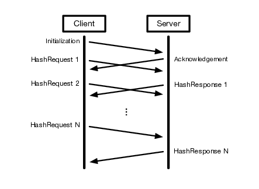
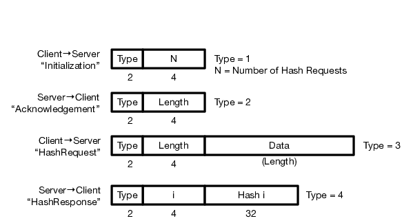

In this assignment, you will write both a TCP client and server. The
client has a file and wants to obtain the hashes for various segments
of the data inside the file. The client will send a message to the
server for each segment, and the server will respond with the hash of
the segment. The client converts each hash into a hexadecimal string
representation, and prints it to the console. The server must be able
to handle more than one client concurrently.

All of the materials you need for this assignment are in this
repository and the `baseline` docker image. You woull submit your
solution by pushing this repository to the server. You may (and are
encouraged to) push to the server as often as you like.

## Protocol

An overview of the protocol is shown below:

The protocol between the client and server will use four types of
messages: Initialization, Acknowledgement, HashRequest, and
HashResponse. The client starts by sending an Initialization message
to the server, which informs the server of the number of hashing
requests that the client will make (denoted by the variable
N). Afterwards, the client sends N HashRequest messages to the server,
where each HashRequest contains the data segment to be hashed. The
server responds to the Initialization message with an Acknowledgement,
which informs the client of the total length of the response. The
server responds to each HashRequest with a HashResponse that contains
the hash of the corresponding data.

The formats for the four types of messages are:

Additional details for each type of message follow.

### Initialization (Client $`\to`$ Server)
 1. Type: A 2-byte integer value in network byte order that is set to the
    value 1.
 2. N: A 4-byte integer value in network byte order that corresponds to
    the number of HashRequests that the client will send to the server.

### Acknowledgement (Server $`\to`$ Client)
 1. Type: A 2-byte integer value in network byte order that is set to the
    value 2.
 2. Length: A 4-byte integer value in network byte order that denotes the
    total length of all HashResponses. This should be equal to 38*N.

### HashRequest (Client $`\to`$ Server)
 1. Type: A 2-byte integer value in network byte order that is set to the
    value 3.
 2. Length: A 4-byte integer value in network byte order that denotes the
    length of the Data payload in number of bytes.
 3. Data: A payload that holds the data segment to be hashed.

### HashResponse (Server $`\to`$ Client)
 1. Type: A 2-byte integer value in network byte order that is set to the
    value 4.
 2. i: A 4-byte integer value in network byte order that denotes the
    zero-based index of the response. That is, the first HashResponse should
    have this set to 0, while the last HashResponse should have this set to
    $`N - 1`$.
 3. Hash i: A 32-byte (256-bit) value that corresponds to the hash of the
    data contained in the ith HashRequest sent by the client.

## Server Implementation

The server will be a command line utility, which takes the following arguments:

 1. `-p <Number>` = Port that the server will bind to and listen on.
    Represented as a base-10 integer. Must be specified, with a value > 1024.
 2. `-s <String>` = Salt that the server will use in computing the hash.
    Represented as an ASCII string. This is an optional argument.

An example usage is as follows:

    server -p 41714 -s newsalt

The server listens for incoming connections on a TCP socket bound to
the port specified in the command line arguments. The server should be
capable of handling multiple concurrent client connections. Three ways
of supporting concurrent connections are `fork()`, threading, or
`select()/poll()` (see their manpages for more information).

For each HashRequest that the server receives from the client, the
server must compute the hash of the data using the `SHA256`
cryptographic message digest function. We provide code that wraps
OpenSSL functionality in the git repository, under the `hash`
directory, and the header file contains information on the API. If the
salt is specified, the server will pass the salt to the wrapper
functions as the binary representation of the ASCII string, not
including the `NULL` byte at the end of the string. Otherwise, if the
salt is not specified, the server passes a `NULL` pointer (and 0
length) to the wrapper functions.

The server is restricted to using at most 1 megabyte of memory for
each client. Clients may request a hash for a source file that exceeds
those bounds. Thus, hashes must be calculated without retaining the
full message in memory. Additionally, the client may issue a large
number of small hashing requests. Therefore, the server should start
sending HashResponses without waiting until the Nth HashRequest has
been received.

## Client Implementation

The client will be a command line utility, which takes the following
arguments:

 1. `-a <String>` = The IP address of the machine that the server is
    running on. Represented as a ASCII string (e.g., 128.8.126.63).
    Must be specified.
 2. `-p <Number>` = The port that the server is bound listening on.
    Represented as a base-10 integer. Must be specified.
 3. `-n <Number>` = The number of HashRequests (N) that the client will send
    to the server. Represented as a base-10 integer. Must be specified, and
    have a value $`\geq 0`$.
 4. `--smin <Number>` = The minimum size for the data payload in each
    HashRequest. Represented as a base-10 integer. Must be specified, and
    have a value $`\geq 1`$.
 5. `--smax <Number>` = The maximum size for the data payload in each
    HashRequest. Represented as a base-10 integer. Must be specified, and
    have a value smin $`\leq`$ smax $`\leq 2^{24}`$.
 6. `-f <File>` = The file that the client reads data from for all
    HashRequests. Must be specified, and have enough data to support N
    requests at the maximum length (specified by `-n` and `-smax`
    respectively).

An example usage is as follows:

    client -a 128.8.126.63 -p 41714 -n 100 --smin=128 --smax=512 -f /dev/zero
    
We provide code that parses the options for you, in the git repository.

After reading in and parsing the command line arguments, the client
will connect to the server and start the protocol by sending the
server an Initialization message. For each one of the N HashRequests,
the client must do the following:

 1. Sample a random number L uniformly at random from the range [SMin,SMax].
 2. Read in the next L bytes from the source file.
 3. Construct and send the HashRequest message using the L bytes read as the
    data payload.

As the client receives each HashResponse, it must print out the index
and thirty-two byte hash contained therein. The index must be in
decimal format, while the hash must be in lowercase hexadecimal
form. They should be separated by a colon and space (`: `) and the
hash must be preceded by `0x`. Each HashResponse should be on a new
line. Here is an example of a correct line of output, corresponding to
the 7th HashResponse received:

    6: 0x147293be17d3bf0e482e44bba5271e3f2cfb1b638b5c59eea2a0fd74c0978509

## Grading

Your project grade will depend on the parts of the project that you
implement. Assuming each part has a "good" implementation, the grades
are as follows:

| **Score** | **Parts Completed**                    |
| ---       | ---                                    |
| 50        | Client and Server (Handles 1+ Clients) |
| 35        | Client and Server (Handles 1 Client)   |
| 20        | Client Only                            |

## Additional Requirements

 1. Your code must be submitted as a series of commits that are pushed to
    the origin/master branch of your Git repository. We consider your latest
    commit prior to the due date/time to represent your submission.
 2. Your git repository must contain a subdirectory called `assignment0`, in
    which your code should be put.
 3. You must provide a Makefile that is included along with the code that you
    commit. We will run `make` inside the `assignment0` directory, which must
    produce two binaries `server` and `client` also located in the
    `assignment0` directory. **Do not commit the compiled binaries.**
 4. You must submit code that compiles in the provided docker image, otherwise
    your assignment will not be graded.
 5. Your code must be `-Wall` clean on gcc/g++ in the provided docker image,
    otherwise your assignment will not be graded. Do not ask the TA for help
    on (or post to the forum) code that is not `-Wall` clean, unless getting
    rid of the warning is the actual problem.
 6. You are not allowed to work in teams or to copy code from any source.
 7. You should complete the serialization homework before this project.
 