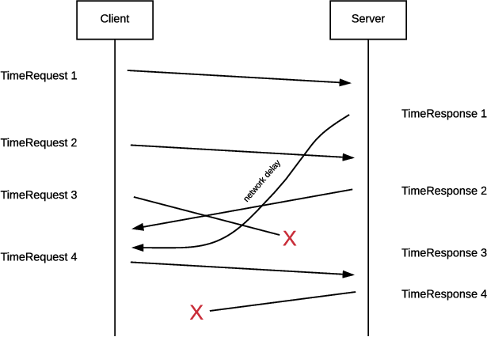
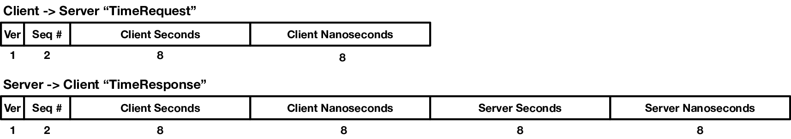

In this assignment, you will write a UDP client and server to run a
simplified version of NTP (Network Time Protocol). In contrast to TCP,
UDP provides fewer properties and guarantees on top of IP. As in TCP,
UDP supports $`2^{16}`$ ports that serve as communication endpoints on a
given host (which is identified by the IP address). Unlike TCP, UDP is
a connection-less protocol, meaning that a source can send data to a
destination without first participating in a "handshaking"
protocol. Additionally, UDP does not handle streams of data, but
rather individual messages which are termed "datagrams". Finally, UDP
**does not** provide the following guarantees:
 1. that datagrams will be delivered,
 2. that the datagrams will be delivered in order,
 3. that the datagrams will be delivered without duplicates.

You can find information on the UDP socket API calls in the
Donahoo/Calvert book. For more information on UDP, you can refer to
Section 5.1 and the introduction to Section 5 in the Peterson/Davie
book.

## Protocol

An overview of the protocol is shown below, including lost and out-of-order
delivery:

The protocol you will implement resembles that of NTP and will use two
types of messages: TimeRequests and TimeResponses. In this project,
the packet payloads will include the time on the machine when the
packet was sent. You will use `clock_gettime()` to get the current time;
that function writes the time into a timespec structure containing two
64-bit unsigned integers (the number of seconds and nanoseconds since
the start of the epoch). These values will be referred to hereon as
the time in seconds and the time in nanoseconds. Unlike the protocol
in `tcp-server`, there is no initialization. The client sends a
TimeRequest that contains a sequence number for the request and a
timestamp of when it sent the payload. Upon receiving the TimeRequest,
the server replies with a TimeResponse that contains the same sequence
number and timestamp in the TimeRequest, as well as a timestamp of
when the server sends the TimeResponse. The formats of these messages
are shown below.

### TimeRequest (Client $`\to`$ Server)

 1. Version: A one-byte integer set to the value 1.
 2. Sequence Number: A two-byte integer in network byte order that
    identifies the ordering of requests sent from the client.
 3. Client Seconds: An eight-byte integer in network byte order
    representing the time in seconds when the client sent the TimeRequest.
 4. Client Nanoseconds: An eight-byte integer in network byte order
    representing the time in nanoseconds when the client sent the TimeRequest.

### TimeResponse (Server $`\to`$ Client)

 1. Version: A one-byte integer set to the value 1.
 2. Sequence Number: A two-byte integer in network byte order that is
    identical to the sequence number sent from the client’s TimeRequest.
 3. Client Seconds: An eight-byte integer in network byte order representing
    the time in seconds when the client sent the TimeRequest.
 4. Client Nanoseconds: An eight-byte integer in network byte order
    representing the time in nanoseconds when the client sent the TimeRequest.
 5. Server Seconds: An eight-byte integer in network byte order representing
    the time in seconds when the server sent the TimeResponse.
 6. Server Nanoseconds: An eight-byte integer in network byte order
    representing the time in nanoseconds when the server sent the TimeResponse.

## Server Implementation

The server is a command-line utility taking the following arguments:

 1. `-p <Number>` = Port that the server binds to and listens on. Represented
    as a base-10 integer. Must be specified, with a value > 1024.
 2. `-d <Number>` = Percentage chance that the server drops any given UDP
    payload that it receives. Represented as a base-10 integer. This parameter
    is optional, but if included, must have a value in [0, 100]. (A 0 value
    means that the server does not purposefully ignore any packets, and a
    value of 100 means that the server ignores all packets.) Omitting this
    flag means that the server does not drop any packets.

An example usage is as follows:

    ./server -p 41717 -d 15

The server binds to the UDP port specified by the command-line
argument and receives incoming TimeRequests. Upon receiving a payload,
the server does the following:

 1. Randomly keeps or ignores the payload. The probability of dropping the
    payload is specified in the command-line arguments.
 2. If the payload is not ignored, takes a timestamp using clock gettime.
 3. If the current sequence number of the payload is lower than the highest
    observed sequence number for that client, prints out the current
    TimeRequest’s sequence number and the highest observed sequence number
    for that client. The format of the print statement should be the address
    and port of the client, separated by a colon, followed by the current
    sequence number and the highest observed sequence number for that client,
    all separated by spaces.
    
        <ADDR>:<Port> <SEQ> <MAX>
    
    If the highest sequence number for a given client has not changed for two
    minutes, the server clears the highest observed sequence number for that
    client, and treats the next (if any) TimeRequest from that same client
    as the new highest sequence number for that client.
 4. Crafts and sends the TimeResponse payload back to the sender of the
    TimeRequest. The TimeResponse is a single datagram. The sequence number
    and client timestamp are the same as the corresponding TimeRequest. The
    server time is the timestamp the server just took.

## Client Implementation

The client is a command-line utility taking the following arguments:

 1. `-a <String>` = The IP address of the server, represented as an ASCII
    string (e.g., 128.8.126.63). Must be specified.
 2. `-p <Number>` = The port that the server is bound listening on.
    Represented as a base-10 integer. Must be specified.
 3. `-n <Number>` = The number of TimeRequests (N) that the client will send
    to the server, represented as a base-10 integer. Must be specified, and
    have a value $`\geq 0`$.
 4. `-t <Number>` = Timeout. The time in seconds (T) that the client will
    wait after sending its last TimeRequest to receive a TimeResponse. The
    timeout resets on each TimeResponse that the client receives. Must be
    specified. A value of 0 indicates the client does not have a timeout and
    thus will wait indefinitely for dropped TimeResponses.

An example usage is as follows:

    ./client -a 128.8.126.63 -p 41717 -n 100 -t 5

### Sending TimeRequests

As specified by the command-line arguments, the client sends N
TimeRequest UDP payloads (each TimeRequest is a single UDP
datagram). For each TimeRequest the client sends, the client:

 1. Determines the current sequence number. The first TimeRequest the
    client sends has sequence number 1, the second has sequence number 2,
    and so on.
 2. Takes the current time, using `clock_gettime`.
 3. Crafts and sends the TimeRequest payload by including the sequence
    number and the timestamp.

### Receiving TimeResponses

The client calculates the differences of timestamps upon receiving a
TimeResponse. For each TimeResponse the client receives, the client:

 1. Takes the current time using `clock_gettime`. We refer to this timestamp
    as $`T_2`$.
 2. Retrieves the original client timestamp and the timestamp generated by
    the server from the TimeResponse payload. We refer to the original
    client timestamp as $`T_0`$ and the server timestamp as $`T_1`$.
 3. Computes the time offset ($`\theta`$) and round-trip delay ($`\delta`$)
    for the given sequence number as:
    
    $`\theta = \frac{(T_1 − T_0) + (T_1 −T_2)}{2}`$
    
    $`\delta = T_2 - T_0 `$

### Client Output

The client sends all N TimeRequests. When the client has sent the Nth
TimeRequest, the client starts keeping track of how long it takes to receive
a TimeResponse. If the client receives a TimeResponse within the timeout,
the client resets the timeout, and tries to receive another response within
the timeout, and so on. This process continues until either all TimeResponses
are received, or a timeout occurs -- whichever happens first. The client then
outputs N lines corresponding to the N TimeRequests, printed in ascending
order of sequence number, and exits. For a TimeRequest that received
a TimeResponse, the output line is:

    <SEQ>: <THETA> <DELTA>

where *SEQ* is a decimal value and *THETA* and *DELTA* are in seconds printed
to four decimal places. For a TimeRequest that did not receive a
TimeResponse, the output line is:

    <SEQ>: Dropped
    
An example output when N=4 is:

    1: -0.0555 0.5551
    2: Dropped
    3: 0.1055 1.1230
    4: Dropped

## Grading

Your project grade will depend on the parts of the project that you
implement. Each letter grade also depends on successful completion of
the parts mentioned for all lower letter grades. Assuming each part
has a "good" implementation, the grades are as follows:

| **Grade** | **Parts Completed**                                     |
| ---       | ---                                                     |
| 20        | Protocol completes using UDP when there are no errors   |
| 35        | Handle dropped and out-of-order packets with 1 Client   |
| 50        | Handle dropped and out-of-order packets with >1 Clients |

## Additional Requirements

 1. Your code must be submitted as a series of commits that are pushed to
    the origin/master branch of your Git repository. We consider your
    latest commit prior to the due date/time to represent your submission.
 2. Your git repository must contain a subdirectory called `assignment1`,
    in which your code should be put.
 3. You must provide a Makefile that is included along with the code that
    you commit. We will run `make` inside the `assignment1` directory, which
    must produce two binaries `server` and `client` also located in the
    `assignment1` directory.
 4. You must submit code that compiles in the baseline docker image, otherwise
    your assignment will not be graded.
 5. Your code must be `-Wall` clean on gcc/g++ in the baseline image,
    otherwise your assignment will not be graded. Do not ask the TA for help
    on (or post to the forum) code that is not `-Wall` clean, unless getting
    rid of the warning is the actual problem.
 6. You are not allowed to work in teams or to copy code from any source.
 